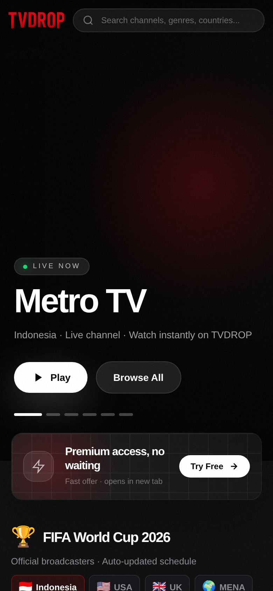
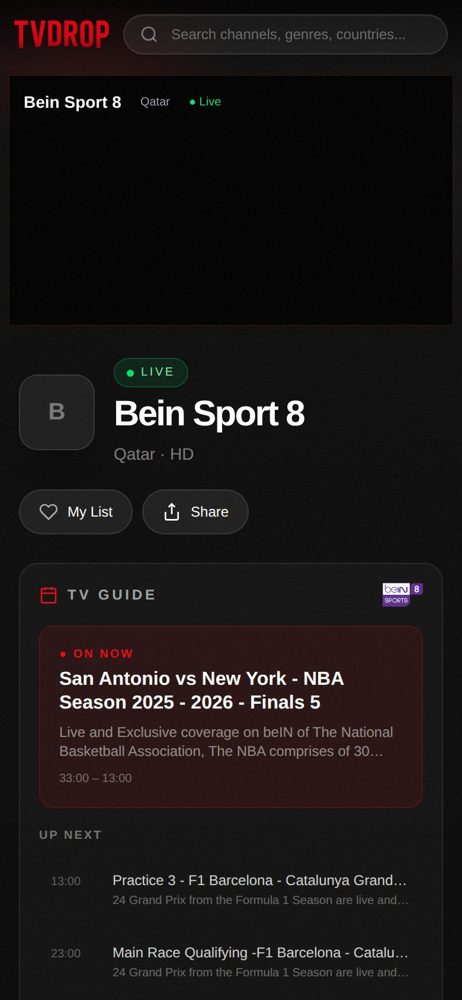
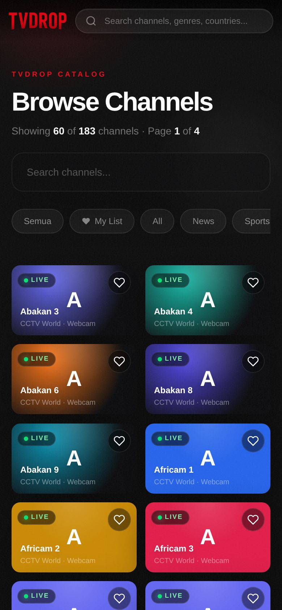

# TVDROP — Free Live TV from Around the World 🌍📺

**6100+ channels · 100+ countries · World Cup 2026 · CCTV World · beIN EPG**

[](https://tv.drop.my.id)
[](https://tv.drop.my.id/semua)
[](LICENSE)

Free IPTV web player — no app install, no signup, works on any browser (desktop & mobile).

## ✨ Features

- 📺 **6360+ live channels** from 100+ countries
- 🏆 **World Cup 2026** — live schedule, beIN SPORTS broadcasters, auto-updated
- 📷 **CCTV World** — 180+ live webcams worldwide (wildlife, cities, beaches)
- 📅 **TV Guide (EPG)** — beIN SPORTS MENA with full programme info
- 🔴 **Live badge** — real-time stream health indicator
- 🎨 **Netflix-style UI** — dark theme, glass morphism, cinematic hero
- 📱 **Mobile-first** — responsive, touch-friendly, landscape lock on fullscreen
- ⚡ **HLS.js player** — quality selector, PiP, keyboard shortcuts
- 🔍 **Search & filter** — by name, country, genre
- ❤️ **Favorites** — save channels to My List (localStorage)
- 💰 **100% free** — no subscription, no login

## 🚀 Tech Stack

| Layer | Tech |
|-------|------|
| Frontend | Next.js 16, React, Tailwind CSS |
| Player | HLS.js + DASH.js |
| API | Next.js API routes |
| Data | 6360 channels in JSON |
| Deploy | PM2 + Nginx + Let's Encrypt |

## 📸 Screenshots

<p align="center">
  
  
  
</p>

## 📅 Recent Updates (June 2026)

- **CCTV World** — 180+ live webcams (explore.org wildlife, city cams, beach views)
- **beIN SPORTS EPG** — TV Guide with current + upcoming programmes (49 channels)
- **Match cleanup** — client-side auto-hide finished matches (3h buffer, extra time safe)
- **Header injection proxy** — bypass geo-block with custom Referer/UA per channel  
- **DhanyTV merge** — 164 new Indonesian channels
- **Channel dedup** — removed 1000+ dead webcam streams
- **Performance** — API caching, pagination, lite mode, health scanner

## 🛠 Setup

```bash
git clone https://github.com/reydenim/tvdrop.git
cd tvdrop/tv-web
npm install
npm run dev
# Open http://localhost:3000
```

**Production:**
```bash
npm run build
PORT=3100 pm2 start "npm start" --name tv-web
# Configure nginx reverse proxy to :3100
```

## 📂 Data

Channel data lives in `src/data/channels.json` (6360 entries). Sources:
- iptv-org/iptv (base catalog)
- dhanytv (Indonesian channels)
- bplaytv/IPTV-Channels (webcams)
- kora-api.space (World Cup schedule)
- beIN Sports MENA EPG

## 📄 License

MIT © 2026 Rey Denim Osborn
